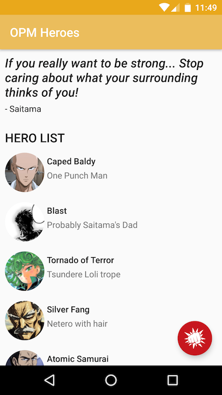

**[One Punch Man (OPM)](https://en.wikipedia.org/wiki/One-Punch_Man) Heroes** is an App that aim to demonstrate the following:

- MVVM with Data Binding and Android Architecture Component (Live Data)
- Full Kotlin usage for writing app and its test cases.
- Combining JUnit 5 with PowerMock, Mockito, AssertJ and Robolectric



This app has three feature:

- Show a list of heroes
- Show a random hero quote
- Refresh a hero quote when FAB is clicked

**Heroes images is taken from [OPM Wikia](onepunchman.wikia.com)

---

### Bind once, observe everywhere.

Or so I thought.

Turns out combining Data Binding and Architecture Components are not that easy. View (Android Activity) is only interested in a LiveData inside a ViewModel. But View (Android Layout) is only interested in an Observable. Now we have two Class who act as an Observable. How to combine best of two world?

My first solution is a little bit dirty (but works). Activity will observe to LiveData, and then propagate the value to Observable on ViewModel. This isn't ideal because its defeat the Data Binding purpose, which is to eliminate glue code between a View and a Model. Updating Observable one by one is similar to updating each view manually.

```kotlin
class QuoteViewModel(application: Application) : AndroidViewModel(application) {
    private val quoteEntityLiveData: LiveData<QuoteEntity> = MutableLiveData()
    val author = ObservableField<String>()
    val quote = ObservableField<String>()
}
```


The second and final solution only possible with latest update from [android gradle plugin (3.1.0-alpha6)](https://androidstudio.googleblog.com/2017/12/android-studio-31-canary-6-is-now.html). Now a Layout can bind data directly from a LiveData.

```kotlin
class QuoteViewModel(application: Application) : AndroidViewModel(application) {
    val quoteModelLiveData: MutableLiveData<QuoteModel> = MutableLiveData()
    // no more ObservableField!
}
```

You don't even need to get LiveData `value` in xml. Just access the the value on LiveData directly i.e `quote` and `author`.


```xml
 <TextView
     android:layout_width="match_parent"
     android:layout_height="wrap_content"
     android:text="@{quoteViewModel.quoteModelLiveData.quote}" />

<TextView
    android:layout_width="match_parent"
    android:layout_height="wrap_content"
    android:text="@{`- ` + quoteViewModel.quoteModelLiveData.author}"  />
```

Thanks Android Team for making Data Binding great again!
